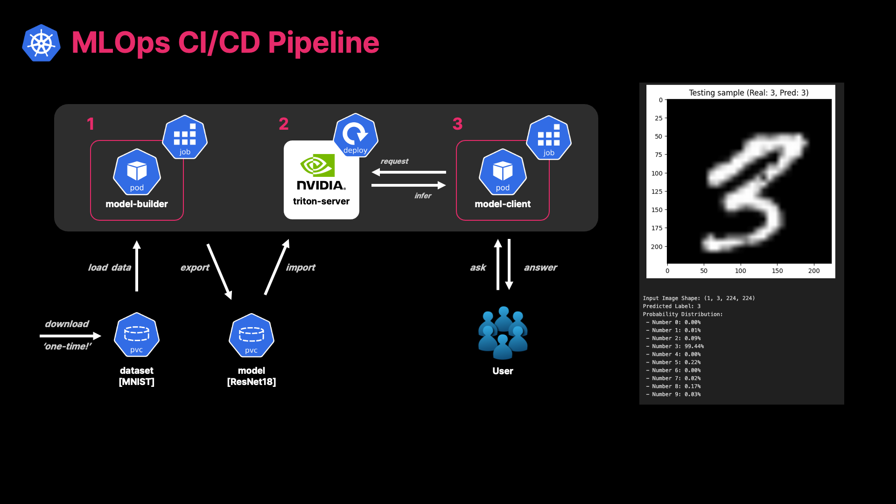

# pilot-mlops-cicd

An awesome example for MLOps CI/CD: Model Training & Serving and Its Infra...

---

This project implements a complete MLOps pipeline from model training to service deployment in a Cloud Native environment.

## TL;DR

- Why this project?
    - To implement a complete MLOps pipeline from model training to service deployment in a Cloud Native environment.
    - To provide a reference implementation of MLOps pipeline for future projects.
- What did we do?
    1. Do Jupyter Notebook PoC using NVIDIA Triton Inference Server
    1. Build a CI/CD system for model training and deployment
    1. Do demonstrations using Kubernetes clusters
    1. And all resources are integrated into this repository
        - [x] The Docker images are built and pushed to GitHub Container Registry. (CI/CD for CI/CD)
        - [ ] The Helm charts are published to GitHub Container Registry. (IaC)

## Project Goals

### MLOps Pipeline Implementation
- Build a CI/CD system for model training and deployment
- Persistent Storage for datasets and models
- Implement a model training and export workflow in Kubernetes environments

## Tech Stack

### Infrastructure & Deployment
- Kubernetes
- Workload Manifests

#### Roadmap
- [ ] Helm Charts for workloads
- [x] CI: GitHub Actions
- [ ] CD: GitOps with ArgoCD

### ML Components
- Base Model: ResNet-18
- Dataset: MNIST
- Language: Python
- Serving Platform: NVIDIA Triton Inference Server

## Getting Started
- To deploy k8s, see [k8s/readme.md](k8s/readme.md)
- To build docker image, see [docker/readme.md](docker/readme.md)

## Project Structure

- assets: Sample images and models
- docker: Dockerfile for model builder and client
- k8s: Kubernetes manifests
- notebooks: Jupyter notebooks for PoC
- sources: Python source code for model builder and model client

## References
### Official
- https://github.com/pytorch/serve
- https://github.com/pytorch/torchscript
- https://github.com/triton-inference-server/server
- https://github.com/triton-inference-server/client
- https://docs.nvidia.com/deeplearning/triton-inference-server/user-guide/docs
- https://catalog.ngc.nvidia.com/orgs/nvidia/containers/tritonserver/tags

### Community
- https://github.com/YH-Wu/Triton-Inference-Server-on-Kubernetes/blob/22.04/README.md
- https://velog.io/@kcw4875/Triton-Inference-Server-%EB%B6%80%EC%88%98%EA%B8%B0
- https://one-way-people.tistory.com/42
